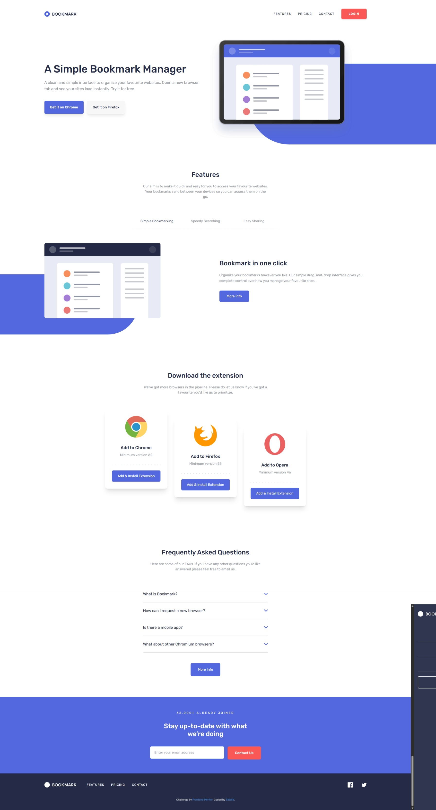

# Frontend Mentor - Bookmark landing page solution

This is a solution to the [Bookmark landing page challenge on Frontend Mentor](https://www.frontendmentor.io/challenges/bookmark-landing-page-5d0b588a9edda32581d29158). Frontend Mentor challenges help you improve your coding skills by building realistic projects. 

## Table of contents

- [Frontend Mentor - Bookmark landing page solution](#frontend-mentor---bookmark-landing-page-solution)
  - [Table of contents](#table-of-contents)
  - [Overview](#overview)
    - [The challenge](#the-challenge)
    - [Screenshot](#screenshot)
    - [Links](#links)
  - [My process](#my-process)
    - [Built with](#built-with)
    - [What I learned](#what-i-learned)
    - [AI Collaboration](#ai-collaboration)
  - [Author](#author)

## Overview

### The challenge

Users should be able to:

- View the optimal layout for the site depending on their device's screen size
- See hover states for all interactive elements on the page
- Receive an error message when the newsletter form is submitted if:
  - The input field is empty
  - The email address is not formatted correctly

### Screenshot

### Links

- Solution URL: [Solution](https://fonsicreus.github.io/FrontEndMentor/Bookmark-Landing-Page-Master/)

## My process

### Built with

- Semantic HTML5 markup
- Tailwind CSS (v4)
- Flexbox
- CSS Grid
- Desktop-first workflow

### What I learned

I learned how to apply everything I had done in previous exercises on a single page, but here’s the interesting part: I learned new JavaScript practices to make everything more readable and better organized.

### AI Collaboration

I used the AI to help me with the initial setup, including Tailwind configuration and project structure and also asking for advice on structures and best practices, and asking things I didn’t know.

## Author

- Frontend Mentor - [@Fonsicreus](https://www.frontendmentor.io/profile/Fonsicreus)
