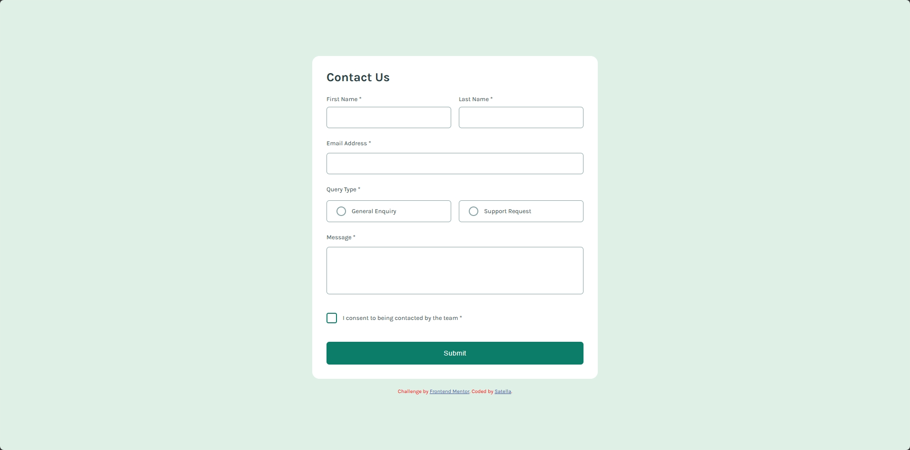

# Frontend Mentor - Contact form solution

This is a solution to the [Contact form challenge on Frontend Mentor](https://www.frontendmentor.io/challenges/contact-form--G-hYlqKJj). Frontend Mentor challenges help you improve your coding skills by building realistic projects. 

## Table of contents

- [Frontend Mentor - Contact form solution](#frontend-mentor---contact-form-solution)
  - [Table of contents](#table-of-contents)
  - [Overview](#overview)
    - [The challenge](#the-challenge)
    - [Screenshot](#screenshot)
    - [Links](#links)
  - [My process](#my-process)
    - [Built with](#built-with)
    - [What I learned](#what-i-learned)
    - [AI Collaboration](#ai-collaboration)
  - [Author](#author)

## Overview

### The challenge

Users should be able to:

- Complete the form and see a success message upon successful submission
- Receive validation messages if required fields are left empty or if the email address is incorrectly formatted
- View the optimal layout for the site depending on their device's screen size
- See hover and focus states for all interactive elements on the page

### Screenshot

### Links

- Solution URL: [Solution](https://fonsicreus.github.io/FrontEndMentor/Contact-Form/)

## My process

### Built with

- Semantic HTML5 markup
- CSS custom properties
- Flexbox
- CSS Grid
- Desktop-first workflow

### What I learned

I learned how to create custom effects for radio buttons, as well the textarea element.

### AI Collaboration

I used the AI to help me with the initial setup, including CSS custom properties from the style guide and project configuration for Vite, make the radio buttons and import the svg.

## Author

- Frontend Mentor - [@Fonsicreus](https://www.frontendmentor.io/profile/Fonsicreus)
