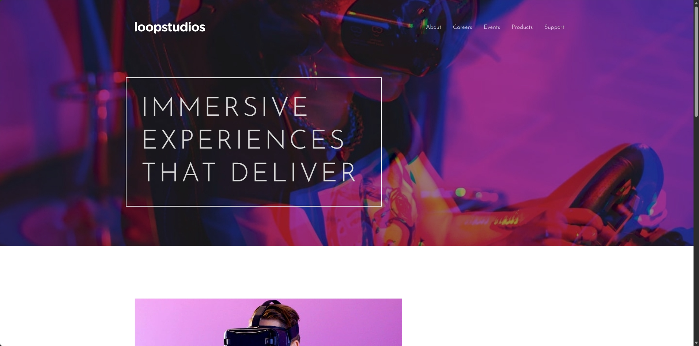

# Frontend Mentor - Loopstudios landing page solution

This is a solution to the [Loopstudios landing page challenge on Frontend Mentor](https://www.frontendmentor.io/challenges/loopstudios-landing-page-N88J5Onjw). Frontend Mentor challenges help you improve your coding skills by building realistic projects. 

## Table of contents

- [Frontend Mentor - Loopstudios landing page solution](#frontend-mentor---loopstudios-landing-page-solution)
  - [Table of contents](#table-of-contents)
  - [Overview](#overview)
    - [The challenge](#the-challenge)
    - [Screenshot](#screenshot)
    - [Links](#links)
  - [My process](#my-process)
    - [Built with](#built-with)
    - [What I learned](#what-i-learned)
    - [AI Collaboration](#ai-collaboration)
  - [Author](#author)

## Overview

### The challenge

Users should be able to:

- View the optimal layout for the site depending on their device's screen size
- See hover states for all interactive elements on the page

### Screenshot

### Links

- Solution URL: [Solution](https://fonsicreus.github.io/FrontEndMentor/Loopstudios-Landing-Page/)

## My process

### Built with

- Semantic HTML5 markup
- Tailwind CSS (v4)
- Flexbox
- CSS Grid
- Desktop-first workflow

### What I learned

I improved with Tailwind and learned how to use it with JavaScript — a bit confusing at times. I like the idea of creating @apply classes, even though the creator doesn’t like it. I have no idea why there’s so much space between the main section and the header on mobile.

### AI Collaboration

I used the AI to help me with the initial setup, including Tailwind configuration and project structure.

## Author

- Frontend Mentor - [@Fonsicreus](https://www.frontendmentor.io/profile/Fonsicreus)
